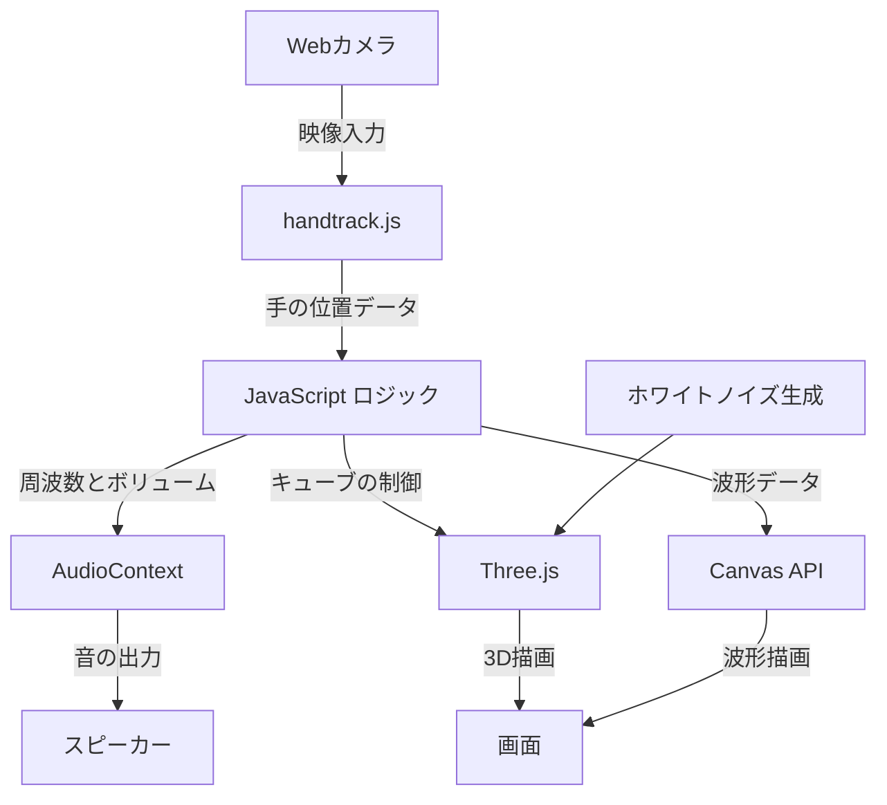

# sc4pe-pre

## 概要

このプロジェクトは、Web カメラを使用してハンドジェスチャーを認識し、リアルタイムで 3D キューブと音を制御する全画面 Canvas アプリです。背景には動的に生成されるホワイトノイズの砂嵐が表示され、ハンドジェスチャーに基づいて音の周波数とボリュームが調整されます。

## 機能

- Web カメラを使用したハンドジェスチャー認識
- ハンドジェスチャーに基づく 3D キューブの制御（サイズ、色、回転）
- ハンドジェスチャーに基づく音の周波数とボリュームの制御
- 動的に生成されるホワイトノイズの砂嵐背景
- 波形のリアルタイム表示
- 音の周波数をひらがなに変換し、読み上げ

## デモ

以下は、アプリの動作イメージです。


## 利用方法

### 1. リポジトリをクローンする

```sh
git clone https://github.com/yourusername/your-repo-name.git
cd your-repo-name
```

### 2. 必要な依存関係をインストールする

このプロジェクトには、以下のライブラリが必要です。

- handtrack.js
- three.js

インターネット接続がある場合、以下のスクリプトタグを HTML に追加するだけでライブラリを読み込むことができます。

```html
<script src="https://cdn.jsdelivr.net/npm/handtrackjs@0.0.13/dist/handtrack.min.js"></script>
<script src="https://cdnjs.cloudflare.com/ajax/libs/three.js/r128/three.min.js"></script>
```

### 3. アプリを実行する

単純な Web サーバーを使用してアプリを実行します。例えば、Python の HTTP サーバーを使用できます。

```sh
python -m http.server
```

その後、ブラウザで `http://localhost:8000` を開きます。

## アーキテクチャ

以下の mermaid 記法を使用して、アプリケーションのアーキテクチャを示します。



### コンポーネント

1. **Web カメラ**: ユーザーの映像をキャプチャします。
2. **handtrack.js**: Web カメラの映像から手の位置を認識します。
3. **JavaScript ロジック**: 手の位置データを処理し、音の周波数とボリュームを制御します。また、3D キューブのサイズ、色、回転を制御します。
4. **AudioContext**: 音の生成と制御を行います。
5. **Three.js**: 3D キューブとホワイトノイズ背景を描画します。
6. **Canvas API**: 波形をリアルタイムで描画します。
7. **スピーカー**: 音を出力します。
8. **画面**: ユーザーに 3D キューブ、ホワイトノイズ、波形を表示します。

## ライセンス

このプロジェクトは MIT ライセンスの下で公開されています。詳細については、[LICENSE](LICENSE)ファイルを参照してください。

## 貢献

バグ報告や新機能の提案、プルリクエストは大歓迎です。貢献方法については、[CONTRIBUTING.md](CONTRIBUTING.md)を参照してください。
